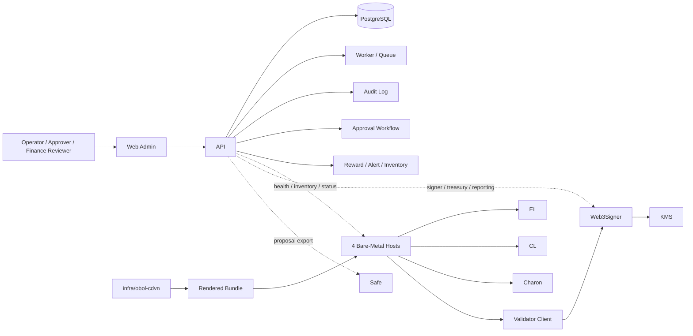

# ETH Treasury Staking Automation Docs

이 문서가 제품/운영 정책의 source of truth다.
기존의 `beginner-guide`, `repo-guide`, `architecture`, `runtime-*`, `dvt-cluster-walkthrough`,
`bring-up-checklist`, `cdvn-*`, `approval-audit`, `observability-alerting`,
`publish-safety-checklist`, `repo-bootstrap`, `harness-bootstrap` 내용을 여기로 통합했다.

로컬에서 runtime automation smoke test를 실행하는 절차는 `docs/local-runtime-test.md`를 본다.
Safe 기반 단독 소유권 입증과 DKG key control 제출용 초안은 `docs/sole-ownership-and-key-control-draft.md`를 본다.

## 1. 한 줄 정의

이 레포는 ETH Treasury 운영자가 validator 생애주기, DVT node runtime, signer custody,
approval workflow, Safe export, reward accounting, audit log를 하나의 운영 시스템에서
관리하기 위한 control plane + runtime automation monorepo다.

단순 validator 대시보드가 아니다. 목표는 두 가지를 동시에 만족하는 것이다.

- 운영 자동화 플랫폼
- 승인 기반 자금 집행 통제 시스템

## 2. 먼저 기억할 안전 계약

이 레포의 설계는 편의성보다 안정성과 감사 가능성을 우선한다.

자동화 허용:

- node 상태 수집
- metrics/logs/traces 수집
- disk, memory, peer, sync lag 감지
- CDVN runtime render, verify, rsync rollout
- host preflight, remote compose 실행
- validator/node/cluster/signer inventory 동기화
- reward accounting 계산
- Safe transaction proposal payload 생성
- alert routing

승인 기반 반자동화:

- DKG ceremony 준비와 실행 추적
- 신규 validator 생성 요청
- deposit data 업로드와 검증
- 예치 실행 전 승인 생성
- DVT cluster 배치 준비
- remote signer 등록
- fee recipient 정책 반영
- Safe multisig proposal 생성과 OVM account export
- `.charon` artifact stage
- CDVN rollout

자동화 금지:

- mnemonic 생성 후 자동 보관
- seed, mnemonic, raw validator signing key를 앱 DB에 저장
- validator signing key raw material을 Web3Signer + KMS 경로 밖으로 복제
- withdrawal credential 자동 변경
- slash protection을 무시한 이중 활성화
- 승인 없는 deposit submit
- 승인 없는 emergency failover

핵심 원칙:

- raw key custody는 앱이 맡지 않는다.
- deposit transaction은 자동 서명하지 않는다.
- slash risk가 있는 동작은 자동 실행하지 않는다.
- 사람 승인 대상과 자동화 대상을 명확히 분리한다.
- 모든 주요 운영 행위는 audit log를 남긴다.

## 3. 제품 범위

현재 운영 가정:

- DVT는 Obol Network를 사용한다.
- operator runtime baseline은 Obol `charon-distributed-validator-node`를 사용한다.
- validator client signing path는 Web3Signer + KMS 조합을 사용한다.
- 운영 인프라는 4대 bare-metal operator host를 기준으로 한다.
- treasury execution account는 Safe multisig contract이며, OVM account로 취급한다.

핵심 사용자:

- Treasury Operator: validator 현황, 장애, reward, 리포트를 본다.
- Infra Operator: host, client, runtime, rollout, sync 상태를 관리한다.
- Approver: 신규 validator, deposit, signer, rollout 같은 위험 작업을 승인한다.
- Finance Reviewer: reward, cost, net yield, treasury 보고 자료를 확인한다.

MVP 범위:

- 운영자 로그인과 RBAC
- validator, node, cluster, signer inventory
- Obol DVT cluster와 Web3Signer custody metadata
- health dashboard와 alert center
- deposit request workflow
- approval queue
- Safe proposal export
- reward summary dashboard
- audit log
- CDVN baseline/overlay 추적과 4대 bare-metal host automation

비목표:

- mnemonic 생성기 개발
- 온체인 서명 엔진 내장
- 자체 custody wallet 구축
- 완전 자동 예치 실행
- 완전 자동 slash recovery
- 다중 체인 지원

## 4. 시스템 구조



Layer 구분:

- Runtime Layer: EL, CL, VC, Charon, Web3Signer, monitoring stack. `infra/obol-cdvn`에서 관리한다.
- Control Plane Layer: `apps/web`, `apps/api`, `apps/worker`, `packages/db`. inventory, approval, audit, alert, reward, workflow를 담당한다.
- Human Approval Layer: deposit, signer change, rollout, Safe export, DKG 위험 단계처럼 사람 승인이 필요한 작업을 통제한다.

주요 데이터 흐름:

```text
Node / Metrics Endpoint
  -> Worker Ingestion
  -> Health Normalizer
  -> PostgreSQL snapshots
  -> Alert Evaluator
  -> Notification Router
```

```text
Desired cluster topology
  -> CDVN baseline render
  -> overlay merge
  -> 4 bare-metal host rollout
  -> charon peer connect
  -> web3signer binding verify
  -> cluster health snapshot
```

```text
Operator creates deposit request
  -> deposit data upload
  -> validation job
  -> approval workflow
  -> DKG / add-validator ceremony tracked
  -> approved
  -> export Safe / signing payload
  -> Safe multisig review
  -> external execution tracked
```

## 5. 레포 구조와 현재 구현 상태

```text
apps/web
apps/api
apps/worker
packages/db
packages/domain
packages/ui
packages/config
packages/observability
infra/obol-cdvn
docs
```

현재 구현된 것:

- `apps/web`: Next.js 운영자 백오피스. Dashboard, Validators, Nodes, Clusters, Alerts, Deposits, Approvals, Rewards, Audit 화면.
- `apps/api`: NestJS read API, auth stub guard, RBAC guard, OpenAPI `/docs`.
- `apps/worker`: health evaluation job skeleton.
- `packages/db`: Prisma schema와 seed.
- `packages/domain`: 공통 타입, RBAC, fixture.
- `packages/ui`: `Panel`, `StatusBadge`, `MetricStrip`, `DataTable` 등 운영 UI shell.
- `packages/config`: zod 기반 env loader.
- `packages/observability`: structured JSON logger.
- `infra/obol-cdvn`: CDVN `v1.9.5` pinned baseline mirror, `web3signer` / `observability` overlay, inventory 예시, runtime scripts.

현재 API 진입점:

- `/v1/health`
- `/v1/auth/session`
- `/v1/auth/rbac-matrix`
- `/v1/inventory/validators`
- `/v1/inventory/nodes`
- `/v1/inventory/clusters`
- `/v1/inventory/signers`
- `/v1/approvals`
- `/v1/deposits`
- `/v1/audit-logs`
- `/v1/alerts`
- `/v1/rewards`
- `/docs`

현실적인 현재 상태:

- read 중심의 운영 가시성은 연결되어 있다.
- auth/RBAC 모델과 inventory 조회 API/UI가 있다.
- CDVN runtime automation 진입점은 있다.
- approval 결정, deposit 생성/검증/export, Safe proposal write, queue 기반 health/alert, rollback, control plane direct integration은 다음 단계다.

## 6. 로컬 빠른 시작

사전 조건:

- Node.js 20+
- pnpm 10+
- PostgreSQL

```bash
pnpm install
pnpm db:generate
pnpm db:push
pnpm db:seed
pnpm dev
```

기본 진입점:

- Web: `http://localhost:3000`
- API health: `http://localhost:4000/v1/health`
- API docs: `http://localhost:4000/docs`
- API inventory: `http://localhost:4000/v1/inventory/validators`
- API workflows: `http://localhost:4000/v1/approvals`, `http://localhost:4000/v1/deposits`, `http://localhost:4000/v1/audit-logs`
- API insights: `http://localhost:4000/v1/alerts`, `http://localhost:4000/v1/rewards`

Web이 다른 API 주소를 써야 하면 `API_BASE_URL`을 설정한다. 기본값은 `http://localhost:4000`이다.

RBAC 확인 예시:

```bash
curl -s http://localhost:4000/v1/auth/session | jq

curl -s \
  -H "x-eth-user-role: ADMIN" \
  http://localhost:4000/v1/auth/rbac-matrix | jq

curl -i -s \
  -H "x-eth-user-role: INFRA_OPERATOR" \
  http://localhost:4000/v1/rewards
```

마지막 호출은 권한 부족이면 `403`이 나와야 정상이다.

## 7. CDVN baseline과 overlay 정책

이 프로젝트는 Obol `charon-distributed-validator-node`를 DVT operator runtime baseline으로 채택한다.

채택 원칙:

- upstream compose 구조와 서비스 역할 분리를 기준선으로 사용한다.
- 4대 bare-metal host 각각이 하나의 operator node를 담당한다.
- host마다 동일한 자동화 경로를 사용하되, client profile override는 허용한다.
- upstream을 크게 재작성하지 않고 pinned version + overlay patch 전략을 사용한다.

현재 baseline:

- upstream repo: `ObolNetwork/charon-distributed-validator-node`
- pinned ref: `v1.9.5`
- pinned commit: `d8110b1945a5d4d9e21827d5cae94e837bbcb457`
- metadata: `infra/obol-cdvn/baseline/VERSION`
- mirror: `infra/obol-cdvn/baseline/upstream/`

기준선으로 유지하는 것:

- `docker-compose.yml` 중심의 operator node 배포 구조
- `compose-el.yml`, `compose-cl.yml`, `compose-vc.yml`, `compose-mev.yml`, `compose-debug.yml` 분리 방식
- EL / CL / Charon / VC / relay / observability 역할 분리
- `.charon` 디렉토리와 `cluster-lock.json` 중심의 cluster artifact 관리 흐름
- DKG ceremony, ENR peer discovery, relay 사용 방식

우리 시스템에서 overlay로 덮는 것:

- Validator signer: 로컬 `validator_keys` 대신 Web3Signer + KMS 경로.
- Observability: cadvisor, node-exporter, Prometheus template, Loki, Tempo, Charon tracing/logging.
- Control plane: inventory, approval, deposit workflow, audit, reward reporting.
- Treasury execution: Safe multisig OVM account payload export와 tracking. direct execution은 하지 않는다.

Runtime scripts:

- `infra/obol-cdvn/scripts/render.sh`
- `infra/obol-cdvn/scripts/stage-charon-artifacts.sh`
- `infra/obol-cdvn/scripts/verify-baseline.sh`
- `infra/obol-cdvn/scripts/verify.sh`
- `infra/obol-cdvn/scripts/rollout.sh`
- `infra/obol-cdvn/scripts/host-preflight.sh`
- `infra/obol-cdvn/scripts/rollout-exec.sh`
- `infra/obol-cdvn/scripts/drift-check.sh`
- `infra/obol-cdvn/scripts/health-sync.sh`

현재 자동화 경계:

- 가능: host-aware render, approved `.charon` artifact allowlist stage, rendered runtime verify, rsync rollout dry-run/execute, host preflight dry-run/execute, remote compose config/pull/up/ps dry-run/execute, drift-check, health sync payload 생성.
- 남음: 실제 `cluster.yml` / `host.yml` 기본값 연결, Web3Signer TLS/mTLS/auth/KMS 실연동, rollback, control plane approval/health API 직접 연결, script CI test.

## 8. Inventory 계약

`cluster.yml`은 cluster 공통값이다.
operator-local 운영에서는 각 operator가 자기 `host.yml` 하나만 가진다.
`hosts.yml`은 로컬 smoke test나 중앙에서 전체 bundle을 검토해야 할 때 쓰는 편의 파일이다.

현재 `render.sh`는 두 가지 흐름을 지원한다.

- operator-local: `--cluster-file <cluster.yml> --host-file <host.yml>`
- cluster bundle: `--cluster-file <cluster.yml> --hosts-file <hosts.yml>`

inventory가 중요한 이유:

- `render.sh`가 inventory를 읽어 operator runtime bundle을 만든다.
- `rollout.sh`, `host-preflight.sh`, `rollout-exec.sh`가 rendered metadata를 기준으로 움직인다.
- approval file의 cluster, host, policy가 inventory 결과와 맞아야 한다.

`cluster.yml` 필수 결정값:

- `name`
- `network`
- `baselineVersion`
- `overlayProfiles`
- `threshold`
- `operatorCount`
- `composeEnvSample`
- `signerMode`
- `relayMode`
- `monitoringClusterName`
- `serviceOwner`
- `web3signerUrl`
- `web3signerMetricsTarget`
- `web3signerFetch`
- `web3signerFetchIntervalMs`
- `feeRecipientAddress`
- `healthSyncUrl`
- `deploymentRoot`
- `approvalPolicy`

`host.yml` 또는 `hosts.yml` host별 결정값:

- `name`
- `address`
- `role`
- `profile`
- `region`
- `nickname`
- `charonExternalHostname`
- `monitoringPeer`
- `grafanaPort`
- `prometheusPort`
- `sshUser`
- `deploymentPath`

실제 운영용 inventory는 repo 안에 두기보다 별도 secure config 경로에 두는 편이 낫다.

```text
/secure/config/
  cluster.yml
  host.yml
```

operator-local 실행 예시:

```bash
infra/obol-cdvn/scripts/render.sh \
  --cluster-file /secure/config/cluster.yml \
  --host-file /secure/config/host.yml \
  --output-dir /tmp/cdvn-operator-runtime \
  --force
```

`cluster.yml` 예시:

```yaml
cluster:
  name: treasury-mainnet-obol-a
  network: mainnet
  baselineVersion: v1.9.5
  overlayProfiles: web3signer,observability
  threshold: 3
  operatorCount: 4
  composeEnvSample: .env.sample.mainnet
  signerMode: web3signer-kms
  relayMode: obol-default
  monitoringClusterName: treasury-mainnet-obol-a
  serviceOwner: treasury-ops
  web3signerUrl: https://web3signer.example.internal:9000
  web3signerMetricsTarget: web3signer.example.internal:9000
  web3signerFetch: true
  web3signerFetchIntervalMs: 384000
  feeRecipientAddress: 0xREPLACE_ME
  healthSyncUrl: https://ops-api.example.internal/v1/internal/cdvn/health-sync
  deploymentRoot: /opt/obol/treasury-mainnet-obol-a
  approvalPolicy: rollout
```

`host.yml` 예시:

```yaml
host:
  name: operator-1
  address: REPLACE_WITH_IP_OR_DNS
  role: dv-operator
  profile: baseline
  region: ap-northeast-2
  nickname: treasury-op-1
  charonExternalHostname: charon-1.example.com
  monitoringPeer: peer-1
  grafanaPort: 3301
  prometheusPort: 9091
  sshUser: ubuntu
  deploymentPath: /opt/obol/treasury-mainnet-obol-a
```

`hosts.yml`는 전체 bundle 테스트나 검토용으로만 쓴다.

```yaml
hosts:
  - name: operator-1
    address: REPLACE_WITH_IP_OR_DNS
    role: dv-operator
    profile: baseline
    region: ap-northeast-2
    nickname: treasury-op-1
    charonExternalHostname: charon-1.example.com
    monitoringPeer: peer-1
    grafanaPort: 3301
    prometheusPort: 9091
    sshUser: ubuntu
    deploymentPath: /opt/obol/treasury-mainnet-obol-a
```

Inventory 변경 후에는 render와 verify를 다시 수행한다. 특히 cluster 이름, baseline version,
overlay profile, Web3Signer URL, deployment path, host address, hostname 변경은 재-render 대상이다.

## 9. Secrets, `.charon`, Web3Signer/KMS

절대 repo, 일반 runtime bundle, control plane DB에 넣으면 안 되는 것:

- validator signing keystore
- mnemonic
- seed phrase
- raw private key material
- keystore password file
- Web3Signer client private key
- `jwt.hex`
- 실제 approval 파일
- 실제 `cluster.yml`, `host.yml`, `hosts.yml`
- operator-specific DKG output 원본

현재 `stage-charon-artifacts.sh`가 allowlist로 stage 하는 것:

- `.charon/cluster-lock.json`
- `.charon/charon-enr-private-key`
- optional `validator-pubkeys.txt`

stage 금지 대상:

- `.charon/validator_keys/`
- `keystore-*.json`
- keystore password file
- mnemonic, seed, raw secret
- deposit data export file

권장 경로 구조:

```text
/opt/obol/treasury-mainnet-obol-a/
  docker-compose.yml
  docker-compose.override.yml
  .env
  .charon/
  data/
  jwt/

/var/lib/eth-treasury-secrets/treasury-mainnet-obol-a/
  jwt/
    jwt.hex
  web3signer/
    client.crt
    client.key
    ca.crt
```

파일 정책:

- `jwt/jwt.hex`: baseline mirror와 render output에 두지 않는다. 실제 host에서 생성하거나 secure source로 주입한다.
- `.charon/cluster-lock.json`: cluster 공통 artifact다. stage approval이 있어야 한다.
- `.charon/charon-enr-private-key`: host별 artifact다. host 이름과 artifact source가 맞아야 하며, 중앙 control plane에 모으지 않는다.
- `validator-pubkeys.txt`: `WEB3SIGNER_FETCH=false`일 때 필요하다.
- Web3Signer cert/key/CA: repo가 자동 생성하지 않는다. host secret path 또는 mount path 기준으로 관리한다.

Web3Signer/KMS 운영 전에 확정할 값:

- `WEB3SIGNER_URL`
- `WEB3SIGNER_METRICS_TARGET`
- `WEB3SIGNER_FETCH`
- `WEB3SIGNER_FETCH_INTERVAL_MS`
- TLS 사용 여부
- mTLS 사용 여부
- client cert path
- client key path
- CA path
- auth header 방식
- KMS namespace
- key alias 규칙
- 4대 host에서 Web3Signer까지의 네트워크 경로

권장 초기 운영 계약:

- validator client는 로컬 keystore를 쓰지 않는다.
- signing path는 반드시 Web3Signer를 거친다.
- Web3Signer는 KMS-backed signer만 사용한다.
- `WEB3SIGNER_FETCH` 전략은 cluster 단위로 고정한다.
- mTLS 또는 내부망 제한 중 하나는 반드시 둔다.

Preflight required file 예시:

```bash
infra/obol-cdvn/scripts/host-preflight.sh \
  --render-dir /opt/obol/treasury-mainnet-obol-a \
  --local \
  --required-file /var/lib/eth-treasury-secrets/treasury-mainnet-obol-a/jwt/jwt.hex \
  --required-file /var/lib/eth-treasury-secrets/treasury-mainnet-obol-a/web3signer/client.crt \
  --required-file /var/lib/eth-treasury-secrets/treasury-mainnet-obol-a/web3signer/client.key \
  --required-file /var/lib/eth-treasury-secrets/treasury-mainnet-obol-a/web3signer/ca.crt
```

## 10. Approval과 audit 계약

Runtime 쪽 approval은 최소 두 종류로 분리한다.

- `.charon` artifact stage approval: 어떤 DKG / cluster artifact를 runtime에 넣을지 승인한다.
- rollout approval: 그 runtime을 실제 host에 배포하고 실행할지 승인한다.

이 둘을 하나로 합치면 "어떤 artifact를 쓸지"와 "언제 서버에 올릴지"가 섞인다.

`rollout.sh`, `rollout-exec.sh`가 읽는 rollout approval 예시:

```env
APPROVAL_ID=approval_example_rollout_001
APPROVAL_STATUS=APPROVED
APPROVAL_POLICY=rollout
CLUSTER_NAME=treasury-mainnet-obol-a
HOST_NAME=operator-1
APPROVED_BY=approver@example.com
APPROVED_AT=2026-04-15T01:00:00Z
```

`stage-charon-artifacts.sh`가 읽는 artifact stage approval 예시:

```env
APPROVAL_ID=approval_example_charon_artifact_stage_001
APPROVAL_STATUS=APPROVED
APPROVAL_POLICY=charon-artifact-stage
CLUSTER_NAME=treasury-mainnet-obol-a
HOST_NAME=operator-1
APPROVED_BY=approver@example.com
APPROVED_AT=2026-04-15T02:00:00Z
```

필수 정합성:

- `APPROVAL_STATUS=APPROVED`
- `APPROVAL_POLICY`가 스크립트 기대값과 일치
- `CLUSTER_NAME`이 render metadata와 일치
- `HOST_NAME`이 대상 host와 일치

권장 저장 구조:

```text
/secure/approvals/
  active/
    operator-1-charon-stage.env
    operator-1-rollout.env
    operator-2-charon-stage.env
    operator-2-rollout.env
  archive/
    2026-04-15/
      approval_example_rollout_001.env
      approval_example_charon_artifact_stage_001.env
```

Approval 외 함께 남겨야 하는 증빙:

- render 시각
- rendered runtime path/hash
- `render-metadata.env`
- `charon-artifacts-staging.env`
- rollout 대상 경로
- 실행자
- 실행 시각
- dry-run 결과
- execute 결과

Stop rule:

- approval의 `HOST_NAME`과 실제 대상 host가 다르다.
- approval의 `CLUSTER_NAME`과 render metadata가 다르다.
- `APPROVAL_POLICY` mismatch가 난다.
- approval status가 `APPROVED`가 아니다.
- artifact source와 staging metadata가 다르다.

나중에 control plane으로 넘어갈 때도 핵심 계약은 유지한다.

- host 단위 승인
- policy 단위 승인
- 승인자와 시각 기록
- audit trace 보존

## 11. Observability와 alerting

현재 `observability` overlay가 넣는 것:

- `cadvisor`
- `node-exporter`
- `tempo`
- `loki`
- Prometheus scrape config template
- Charon tracing / logging env override

실운영 전에 결정할 것:

- Prometheus scrape 구조: host local, central scrape, hybrid 중 선택.
- Loki / Tempo 저장 전략: host local, external endpoint, retention, 장애 시 보존.
- alert routing: Slack, PagerDuty, email, ops room 등.
- health sync endpoint: URL, auth, 저장 방식, inventory/alert/audit 연결.
- port/firewall 정책: host별 `grafanaPort`, `prometheusPort`, Web3Signer metrics 접근 경로.

최소 수집 대상:

- host resource
- container 상태
- Charon 상태
- validator client 상태
- Web3Signer metrics
- logs
- health sync snapshot

Validating 판정에 필요한 관측 포인트:

- Charon peer 연결 상태
- EL / CL sync 상태
- validator client external signer 연결 상태
- Web3Signer endpoint health
- host resource 상태
- 심각 alert 없음

`docker compose ps`에서 컨테이너가 떠 있는 것만으로 validating이라고 판단하면 안 된다.

## 12. Runtime automation 로컬 smoke test

실제 bare-metal host나 실제 DKG artifact 없이 operator-local runtime 흐름을 검증할 수 있다.
전체 실행 절차와 negative test는 `docs/local-runtime-test.md`를 기준으로 한다.

핵심 경로:

```bash
BASE=/tmp/cdvn-local-runtime-test
mkdir -p "$BASE"

infra/obol-cdvn/scripts/verify-baseline.sh

infra/obol-cdvn/scripts/render.sh \
  --cluster-file infra/obol-cdvn/inventory/cluster.example.yml \
  --host-file infra/obol-cdvn/inventory/operator-1.local.example.yml \
  --output-dir "$BASE/operator-1-runtime" \
  --force

infra/obol-cdvn/scripts/verify.sh \
  --render-dir "$BASE/operator-1-runtime"

infra/obol-cdvn/scripts/rollout.sh \
  --render-dir "$BASE/operator-1-runtime" \
  --approval-file infra/obol-cdvn/scripts/rollout-approval.example.env \
  --destination "$BASE/deploy/operator-1"
```

로컬 smoke test에서 확인해야 하는 핵심은 세 가지다.

- `--host-file` render가 operator 하나의 runtime만 만든다.
- `.charon` artifact stage는 `--runtime-dir` 기준으로 operator-local path에만 실행된다.
- rollout 기본값은 `.charon/`, `charon-artifacts-staging.env`, `validator-pubkeys.txt`, `jwt/jwt.hex`를 제외한다.

`--hosts-file` cluster bundle render는 전체 bundle 검토나 테스트용 편의 경로다.
실운영에서는 각 operator가 자기 `host.yml`로 render하고 자기 host-local artifact만 stage한다.

## 13. 신규 DVT cluster bring-up runbook

시나리오 가정:

- network: `mainnet`
- cluster: `treasury-mainnet-obol-a`
- operator hosts: 4
- threshold: 3-of-4
- runtime baseline: Obol CDVN
- signer path: Web3Signer + KMS
- treasury execution account: Safe multisig

Host 예시:

- `operator-1`
- `operator-2`
- `operator-3`
- `operator-4`

전체 순서:

```text
inventory 준비
  -> approved artifact 준비
  -> render
  -> rendered runtime verify
  -> rollout dry-run
  -> rollout execute
  -> host preflight
  -> operator-local artifact stage
  -> deployed runtime verify
  -> remote compose execute
  -> threshold / duties 확인
  -> validating 판정
```

### 13.1 서버가 오기 전

먼저 문서 또는 secure config로 아래를 정한다.

- `cluster.yml` 초안
- operator별 `host.yml` naming 규칙
- Web3Signer endpoint
- KMS namespace와 key alias 규칙
- secret 경로 정책
- approval 파일 저장 정책
- alert 채널

### 13.2 서버 준비 직후

각 host에 대해 확인한다.

- 공인 또는 사설 IP
- SSH 접속 가능 여부
- `sshUser`
- 배포 경로 생성 가능 여부
- Docker 설치 정책
- Docker Compose 사용 가능 여부
- 디스크 여유
- 시간 동기화 정책
- open port 정책

### 13.3 Inventory 확정

예시에서 시작:

```bash
cp infra/obol-cdvn/inventory/cluster.example.yml /secure/config/cluster.yml
cp infra/obol-cdvn/inventory/operator-1.local.example.yml /secure/config/host.yml
```

각 operator는 자기 값으로 `/secure/config/host.yml`만 수정한다.
4대 전체 host 정보를 한 파일에 모을 필요는 없다.

### 13.4 Approved artifact 준비

이 단계는 DKG가 완료되어 runtime에 필요한 cluster artifact가 승인된 상태를 의미한다.
DKG ceremony 자체는 현재 이 레포가 자동 수행하지 않는다.

현재 `web3signer` overlay 기준으로 runtime에 들어갈 수 있는 것은 아래뿐이다.

- `cluster-lock.json`
- `charon-enr-private-key`
- optional `validator-pubkeys.txt`

여기서 헷갈리기 쉬운 점이 있다.
DKG 결과는 operator별로 자기 operator에 해당하는 artifact set이 하나씩 준비되는 것이 맞다.
특히 validator signing key share나 keystore 성격의 산출물을 중앙 control plane이나
중앙 staging host에 모으지 않는 것이 DKG의 핵심 보안 목적이다.

따라서 실운영 원칙은 아래와 같다.

- operator별 DKG output은 해당 operator의 secure host-local path에만 둔다.
- control plane은 artifact 원본 파일을 보관하지 않는다.
- control plane은 approval id, hash, operator id, source reference 같은 감사 metadata만 보관한다.
- 중앙에 4대 operator의 artifact 파일을 한 번에 모아두는 layout은 사용하지 않는다.
- 잠깐이라도 raw key material, validator keystore, validator key share를 캐시나 DB에 저장하지 않는다.

단일 operator 기준 host-local source layout:

```text
/var/lib/eth-treasury-operator-artifacts/treasury-mainnet-obol-a/
  .charon/
    cluster-lock.json
    charon-enr-private-key
  validator-pubkeys.txt
```

각 operator host에는 자기 source dir 하나만 있어야 한다.
예를 들어 `operator-1` host는 `operator-1`용 artifact set만 가진다.
`operator-2`부터 `operator-4`의 operator-specific artifact가 `operator-1` host에 있으면 안 된다.

```text
operator-1 host:
  /var/lib/eth-treasury-operator-artifacts/treasury-mainnet-obol-a/.charon/...

operator-2 host:
  /var/lib/eth-treasury-operator-artifacts/treasury-mainnet-obol-a/.charon/...

operator-3 host:
  /var/lib/eth-treasury-operator-artifacts/treasury-mainnet-obol-a/.charon/...

operator-4 host:
  /var/lib/eth-treasury-operator-artifacts/treasury-mainnet-obol-a/.charon/...
```

현재 `stage-charon-artifacts.sh`는 `--runtime-dir`를 기준으로 host-local runtime에 stage하는 흐름을 지원한다.
`--render-dir` mode는 로컬 검토와 dry-run용이며, `--execute`는 기본적으로 차단된다.
실운영에서는 아래 원칙을 지킨다.

- operator host 안에서 자기 artifact source만 읽어 host-local runtime에 stage 한다.
- control plane은 원격 stage command만 승인/추적하고, artifact 원본은 operator host 밖으로 나오지 않게 한다.

중요한 경계:

- `cluster-lock.json`은 cluster 전체에 공통인 artifact라서 각 operator source dir에 같은 내용을 복사해 둘 수 있다.
- `charon-enr-private-key`는 host/operator별로 달라야 한다.
- `validator_keys/`, keystore, key share, mnemonic, seed는 stage 대상이 아니다.
- 각 bare-metal host에는 자기 host에 해당하는 staged runtime 하나만 rollout 된다.

### 13.5 Render

```bash
infra/obol-cdvn/scripts/render.sh \
  --cluster-file /secure/config/cluster.yml \
  --host-file /secure/config/host.yml \
  --output-dir /tmp/cdvn-operator-runtime \
  --force
```

성공 구조:

```text
/tmp/cdvn-operator-runtime/
  .env
  docker-compose.yml
  docker-compose.override.yml
  render-metadata.env
  RENDERED_BY_CONTROL_PLANE.txt
  OVERLAY_TODO.md
  ...
```

이 시점의 산출물은 base runtime이다. 아직 `.charon` artifact와 `jwt/jwt.hex`가 들어가면 안 된다.

### 13.6 Rendered runtime verify

```bash
infra/obol-cdvn/scripts/verify.sh \
  --render-dir /tmp/cdvn-operator-runtime
```

확인 대상:

- baseline version mismatch가 없는가
- `jwt/jwt.hex`가 render output에 없는가
- overlay 파일이 기대대로 들어갔는가
- Web3Signer overlay인데 `.charon/validator_keys`가 들어가지 않았는가

실패하면 rollout으로 넘어가지 않는다.

### 13.7 Rollout dry-run

```bash
infra/obol-cdvn/scripts/rollout.sh \
  --render-dir /tmp/cdvn-operator-runtime \
  --approval-file /secure/approvals/operator-1-rollout.env \
  --destination /opt/obol/treasury-mainnet-obol-a
```

Destination 명시 예시:

```bash
infra/obol-cdvn/scripts/rollout.sh \
  --render-dir /tmp/cdvn-operator-runtime \
  --approval-file /secure/approvals/operator-1-rollout.env \
  --destination /opt/obol/treasury-mainnet-obol-a
```

Dry-run에서 확인할 것:

- approval cluster / host / policy가 맞는가
- rsync 대상 경로가 맞는가
- 예상 변경 파일이 맞는가
- `.charon/`, `charon-artifacts-staging.env`, `validator-pubkeys.txt`, `jwt/jwt.hex`가 제외되는가

### 13.8 Rollout execute

Runtime bundle을 대상 host로 보낸다.

```bash
infra/obol-cdvn/scripts/rollout.sh \
  --render-dir /tmp/cdvn-operator-runtime \
  --approval-file /secure/approvals/operator-1-rollout.env \
  --destination /opt/obol/treasury-mainnet-obol-a \
  --execute
```

이 단계는 base runtime 파일 전송 단계다. 아직 `.charon` artifact stage나 `docker compose up`을 실행한 것은 아니다.

### 13.9 Host preflight

Compose 실행 전 실제 host 준비 상태를 확인한다.

이 시점에도 rollout 대상은 host 하나의 runtime 디렉토리뿐이다.
예를 들어 `operator-1` rollout은
`/tmp/cdvn-operator-runtime/`만
`operator-1`의 `deploymentPath`로 rsync 한다.
operator-local artifact source 전체나 다른 operator runtime을 같이 보내는 것이 아니다.

Dry-run:

```bash
infra/obol-cdvn/scripts/host-preflight.sh \
  --render-dir /opt/obol/treasury-mainnet-obol-a \
  --local
```

Execute:

```bash
infra/obol-cdvn/scripts/host-preflight.sh \
  --render-dir /opt/obol/treasury-mainnet-obol-a \
  --local \
  --execute
```

현재 preflight 확인 대상:

- `docker`
- `docker compose`
- `rsync`
- `curl`
- deployment path writable
- 최소 disk 여유
- optional required file

### 13.10 Operator-local artifact stage

이 단계는 operator host에서 실행한다.
control plane machine에 4대 operator의 artifact 원본을 복사해서 실행하면 안 된다.

Dry-run:

```bash
infra/obol-cdvn/scripts/stage-charon-artifacts.sh \
  --runtime-dir /opt/obol/treasury-mainnet-obol-a \
  --host-name operator-1 \
  --approval-file /secure/approvals/operator-1-charon-stage.env \
  --source-dir /var/lib/eth-treasury-operator-artifacts/treasury-mainnet-obol-a
```

Execute:

```bash
infra/obol-cdvn/scripts/stage-charon-artifacts.sh \
  --runtime-dir /opt/obol/treasury-mainnet-obol-a \
  --host-name operator-1 \
  --approval-file /secure/approvals/operator-1-charon-stage.env \
  --source-dir /var/lib/eth-treasury-operator-artifacts/treasury-mainnet-obol-a \
  --execute
```

Stage 결과:

- `.charon/cluster-lock.json`
- `.charon/charon-enr-private-key`
- optional `validator-pubkeys.txt`
- `charon-artifacts-staging.env`

`charon-artifacts-staging.env`에는 approval id, source path, sha256, staged 시각이 기록된다.

### 13.11 Deployed runtime verify

Operator host에서 staged runtime을 검증한다.

```bash
infra/obol-cdvn/scripts/verify.sh \
  --render-dir /opt/obol/treasury-mainnet-obol-a
```

이 단계에서는 staged `.charon` 파일 존재와 `WEB3SIGNER_FETCH=false`일 때 `WEB3SIGNER_PUBLIC_KEYS` 반영 여부까지 확인한다.

### 13.12 Remote compose 실행

Dry-run:

```bash
infra/obol-cdvn/scripts/rollout-exec.sh \
  --render-dir /opt/obol/treasury-mainnet-obol-a \
  --approval-file /secure/approvals/operator-1-rollout.env \
  --local
```

Execute:

```bash
infra/obol-cdvn/scripts/rollout-exec.sh \
  --render-dir /opt/obol/treasury-mainnet-obol-a \
  --approval-file /secure/approvals/operator-1-rollout.env \
  --local \
  --execute
```

현재 이 스크립트가 하는 일:

1. `docker compose config`
2. `docker compose pull`
3. `docker compose up -d`
4. `docker compose ps`

### 13.13 Host 실행 순서

보수적 권장 순서:

1. 각 operator host가 자기 `host.yml`로 render / base verify / rollout을 끝낸다.
2. 각 operator host가 preflight를 통과시킨다.
3. 각 operator host에서 자기 artifact만 stage 한다.
4. staged runtime verify를 통과한 operator host를 하나씩 compose execute 한다.
5. `operator-1`, `operator-2`, `operator-3`가 먼저 올라와 threshold를 채우는지 본다.
6. threshold가 안정적으로 확인되면 `operator-4`를 올린다.

### 13.14 Validating 판정

최소 기준:

- threshold 수 이상의 host에서 core service가 떠 있다.
- `rollout-exec.sh`가 `docker compose ps` 단계까지 통과한다.
- Charon이 ready 상태다.
- EL / CL이 정상 동기화 상태다.
- validator client가 external signer와 통신 가능하다.
- 심각 alert가 없다.

실제 운영 확인 예시:

```bash
ssh ubuntu@203.0.113.11
cd /opt/obol/treasury-mainnet-obol-a
docker compose ps
docker compose logs charon --tail=100
docker compose logs vc-lodestar --tail=100
docker compose exec charon wget -qO- http://localhost:3620/readyz
```

### 13.15 Validating 이후

Drift-check:

```bash
infra/obol-cdvn/scripts/drift-check.sh \
  --render-dir /tmp/cdvn-operator-runtime \
  --destination ubuntu@203.0.113.11:/opt/obol/treasury-mainnet-obol-a
```

Health sync dry-run:

```bash
infra/obol-cdvn/scripts/health-sync.sh \
  --render-dir /opt/obol/treasury-mainnet-obol-a \
  --dry-run
```

남길 운영 기록:

- 어떤 inventory로 render 했는가
- 어떤 approval id를 썼는가
- 어떤 operator-local artifact source reference를 stage 했는가
- 어떤 artifact hash를 썼는가
- 어떤 rendered runtime path/hash를 썼는가
- 어느 host를 어떤 순서로 rollout 했는가
- 언제 threshold가 확인됐는가
- validating 판정 시각
- 남은 known issue

### 13.16 Stop rule과 rollback

아래 상황이면 다음 host 진행을 멈춘다.

- approval mismatch
- render metadata mismatch
- Web3Signer reachability 실패
- required file 없음
- `docker compose config` 실패
- `docker compose pull` 실패
- `docker compose up -d` 실패
- Charon peer가 기대 상태에 못 올라옴
- validator client external signer 연결 실패
- disk 부족

현재 repo에는 자동 rollback이 없다. 최소 수동 정책은 미리 정한다.

- 어떤 실패에서 rollback할지
- 누구 승인으로 rollback할지
- 직전 배포 산출물을 어디에 보관할지
- host별 stop 기준
- rollback도 audit 대상으로 기록할지

## 14. 공개 저장소 안전 체크

이 레포는 public으로 열 수 있다. 단, public repo에는 코드, 문서, example만 둔다.
실운영 입력과 runtime 산출물은 private ops repo 또는 repo 밖 secure path에 둔다.
다만 operator-specific DKG artifact 원본은 private ops repo에도 모으지 말고,
각 operator host의 secure host-local path에만 둔다.

Public repo에 남겨도 되는 것:

- `docs/README.md`
- `apps/*`
- `packages/*`
- `infra/obol-cdvn/baseline/*`
- `infra/obol-cdvn/overlays/*`
- `infra/obol-cdvn/inventory/*.example.yml`
- `infra/obol-cdvn/scripts/*.sh`
- `infra/obol-cdvn/scripts/*example.env`

Public repo에 올라가면 안 되는 것:

- 실제 `infra/obol-cdvn/inventory/cluster.yml`
- 실제 `infra/obol-cdvn/inventory/host.yml`
- 실제 `infra/obol-cdvn/inventory/hosts.yml`
- `.tmp-cdvn-*` 산출물
- rendered runtime `.env`
- `render-bundle.env`
- `render-metadata.env`
- `charon-artifacts-staging.env`
- `.charon/cluster-lock.json`
- `.charon/charon-enr-private-key`
- operator-specific DKG output 원본
- `validator-pubkeys.txt`
- `jwt.hex`
- Web3Signer client cert / key / CA
- 실제 rollout approval / artifact approval 파일
- 내부 URL, 실제 host 주소, 실제 deployment path

공개 전 체크:

```bash
scripts/check-public-repo-safety.sh
```

이미 `charon-enr-private-key`, `jwt.hex`, cert/key/CA, 실제 approval, 실제 inventory가 public remote에 올라갔다면 단순 삭제로 끝내면 안 된다.
유출 범위 확인, git history 정리, secret/cert rotation, ENR/signer/auth 재검토가 필요하다.

## 15. 다음 구현 우선순위

1. health ingestion pipeline + worker/Redis 연동
2. alert center 규칙, ack, write workflow 구현
3. approval decide API와 audit log write 강화
4. deposit request create/validate/export API 구현
5. Safe wallet proposal integration adapter 연결
6. 실제 `cluster.yml`, operator별 `host.yml` 분리와 기본값 연결
7. Web3Signer/KMS TLS, mTLS, auth header, KMS namespace 실연동
8. staged artifact remote hash 검증 추가
9. rollback / stop rule 고도화
10. operator-local stage 실행을 원격 automation / packaging 흐름에 편입
11. `health-sync.sh`와 rollout approval을 control plane API와 연결
12. script smoke test와 CI 편입

Runtime 쪽 다음 작업 상세:

- 각 operator가 자기 bare-metal host의 IP, DNS, SSH user, deployment path, monitoring port, cluster peer 값을 확정한다.
- `cluster.example.yml`, `operator-1.local.example.yml`를 참고해 실운영 `cluster.yml`, `host.yml`를 operator-local secure path에 둔다.
- Lodestar external signer 플래그를 pinned CDVN/Lodestar 조합에서 컨테이너 실행으로 검증한다.
- `host-preflight.sh`에 Web3Signer reachability, required env/secret policy, runtime dependency checks를 더 붙인다.
- approval service 결과를 env 형식으로 export하거나 script가 API에서 approval status를 직접 조회하게 한다.

## 16. Bootstrap 기록

과거 `repo-bootstrap.md`, `harness-bootstrap.md`의 역할은 greenfield 구현 지시였다.
현재 레포는 이미 monorepo scaffold, API/UI read flow, Prisma schema, CDVN runtime automation skeleton이 들어와 있으므로,
새 작업자는 이 문서와 실제 코드 상태를 기준으로 작업한다.

초기 설계가 요구한 고정 조건은 여전히 유효하다.

- TypeScript strict mode
- monorepo 구조
- Prisma + PostgreSQL
- Next.js web
- NestJS API
- worker/queue 기반 비동기 처리
- Obol CDVN baseline + overlay
- Web3Signer + KMS custody
- Safe export까지만 자동화
- 도메인 로직은 UI가 아니라 API/domain/worker 쪽에 둔다
- 운영 UI는 표 중심, 데스크톱 우선, 위험 작업 confirmation 포함

## 17. 용어

- Validator: Ethereum에서 실제 검증 작업을 수행하는 단위.
- Node: validator를 지원하는 실행 환경 또는 서버/클라이언트 묶음.
- DVT: Distributed Validator Technology. 하나의 validator를 여러 operator가 분산 운영하는 방식.
- Obol: DVT 운영을 위한 네트워크/도구 생태계.
- Charon: Obol DVT에서 distributed validator coordination을 담당하는 핵심 구성요소.
- CDVN: `charon-distributed-validator-node`. Obol이 제공하는 distributed validator node baseline repo.
- Web3Signer: validator client가 raw key를 직접 들고 있지 않고 외부 signer에 서명을 요청하도록 하는 signer service.
- KMS: key custody를 안전하게 유지하기 위한 key management system.
- Safe: multisig 기반 treasury execution control에 사용하는 wallet/contract.
- `.charon`: Charon runtime이 필요로 하는 cluster 관련 파일을 담는 디렉토리.
- `cluster-lock.json`: cluster가 어떤 validator 집합과 operator 구성을 갖는지 나타내는 핵심 파일.
- `charon-enr-private-key`: operator의 ENR 관련 개인 키 파일.
- rendered runtime: inventory와 overlay를 반영해 host별로 만든 배포용 runtime 산출물.

## 18. 짧은 결론

이 레포는 "Obol DVT + Web3Signer/KMS + Safe approval flow"를 운영하기 위한 ETH staking control plane 초기 제품이다.

운영자는 이 순서를 기본으로 기억하면 된다.

```text
inventory -> artifact approval -> render -> verify -> rollout -> preflight -> operator-local stage -> deployed verify -> compose execute -> validating 확인
```

위험 작업은 approval과 audit 경계 안에서만 진행한다.
